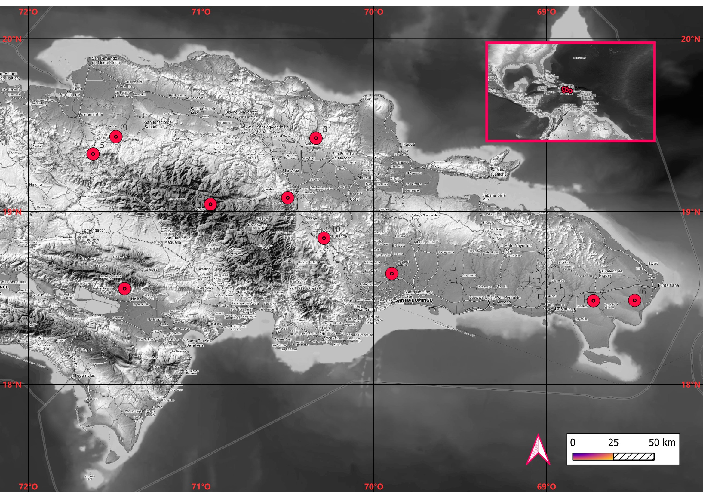
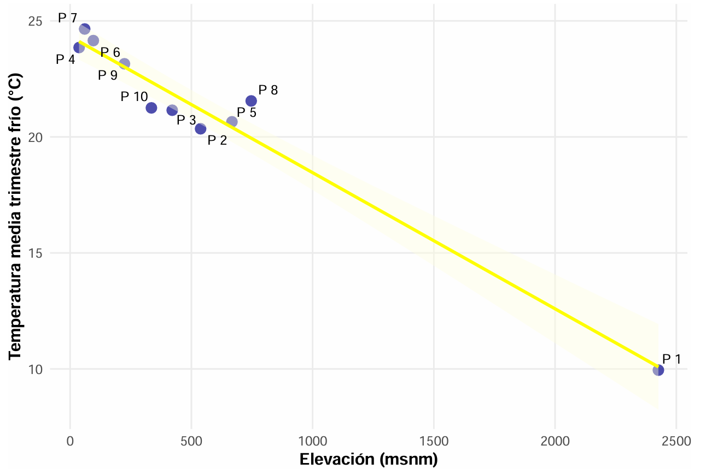

## 1. Introducción {style="font-size: 0.7em;"}

### El Gradiente Altitudinal

-   El medio fisico en biogeografía son factores o condiciones abióticas y procesos que
    influencias donde las especies y comunidades pueden vivir y como están distribuidas en el
    espacio-tiempo, dichos factores interactúan con procesos biológicos que dan forma a
    patrones de biodiversidad (Sanmartín 2012; Matthews y Triantis 2021).
-   Las variables ambientales en ecosistemas se ven relacionadas hasta cierto punto, una relación común es la de altitud sobre el nivel del mar con la temperatura del aire, como en México, donde la temperatura deciende entre 4.5–4.9°C por kilómetro de elevación (Antúnez 2022), o
    en tierras bajas de Ucrania, donde la temperatura deciende 0.69°C por cada 100
    metros de elevación (Boychenko, Maidanovych, y Zabarna 2022).

------------------------------------------------------------------------

## 2. Materiales y Métodos {style="font-size: 0.7em;"}

### Ubicación de los Puntos Aleatorios

Se generaron 10 puntos aleatorios usando la base de datos GADM y el paquete `sf` en R (Pebesma, 2018).

::: {layout-ncol="2"}
-   Las variables provienen de CGIAR y CHELSA v2.1 (Brun et al., 2022).
-   Se utilizaron funciones vectorizadas (`sapply`) e iterativas (`for`) para procesar los datos.

:::

------------------------------------------------------------------------

## 3. Resultados {style="font-size: 0.7em;"}

### Matriz de correlación Pearson

Nótese la correlación de -0.982 entre Elevación y Bio11 (temperatura promedio de trimestre más frío).

|           | Insol  |  Elev  | Bio11  | Bio17 | Bio12 |
|:----------|:------:|:------:|:------:|:-----:|:-----:|
| **Insol** |   —    |        |        |       |       |
| **Elev**  | -0.767 |   —    |        |       |       |
| **Bio11** | 0.763  | -0.982 |   —    |       |       |
| **Bio17** | -0.149 | 0.002  | -0.164 |   —   |       |
| **Bio12** | -0.244 | 0.339  | -0.503 | 0.806 |   —   |

## 3. Resultados {style="font-size: 0.7em;"}

### Análisis de Regresión

El modelo confirma una relación inversamente proporcional: a mayor altitud, menor temperatura.

| Parámetro      | Estimado           | Interpretación                                 |
|----------------------|--------------------|-------------------------------|
| Intercepto (b) | $24.33^{\circ}C$   | Temperatura teórica a nivel del mar.           |
| Pendiente (a)  | $-0.0058^{\circ}C$ | Disminución por cada metro de ascenso.         |
| $R^{2}$        | **0.9638**         | El modelo explica el 96.4% de la variabilidad. |

------------------------------------------------------------------------

## 3. Resultados {style="font-size: 0.7em;"}

### Visualización del Gradiente Térmico

La correlación de Pearson entre elevación y Bio11 fue de $-0.982$.

{fig-align="center"}

------------------------------------------------------------------------

## 4. Discusión {style="font-size: 0.7em;"}

### Implicaciones Biogeográficas 

-   El gradiente de $-0.58^{\circ}C$ cada 100m actúa como un filtro ambiental para la biota.
-   Explica la coexistencia de bosques secos costeros y bosques de pinos de alta montaña.

::: callout-note
### Limitaciones del estudio

El bajo tamaño de muestra ($n=10$) y la resolución de $1 km^{2}$ de CHELSA podrían omitir microclimas locales.
:::

------------------------------------------------------------------------

## 5. Conclusión {style="font-size: 0.7em;"}

-   Se identificó una relación inversa significativa entre la elevación y la temperatura del trimestre más frío.
-   La Cordillera Central se confirma como un eje de estratificación climática fundamental para la isla.
-   Se validó el uso de herramientas de intersección espacial en R para estudios climáticos.
